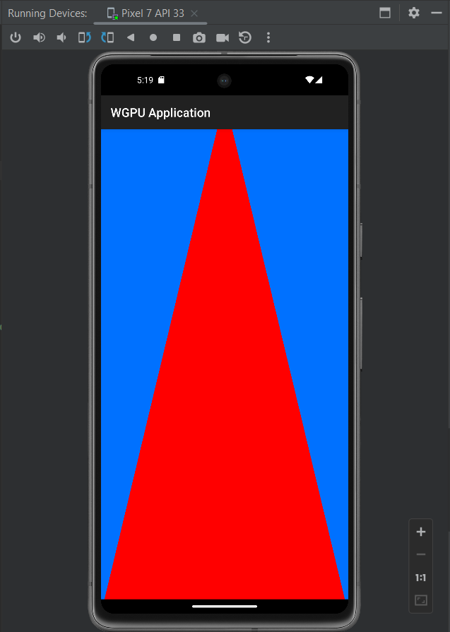

# `wgpu` & `winit` Android Example

Updated fork of <https://github.com/andraantariksa/wgpu-winit-android-example> with:

* Upgraded `winit` to 0.29 and `wgpu` to 0.19
* Upgraded to the latest version of `androidx.games:games-activity`
* Audio stream added using cpal
* Works on Windows too (`cd lib; cargo run`)

## Requirements

* Toolchain target. You can install it by running `rustup target install armv7-linux-androideabi aarch64-linux-android`
* Android Studio and NDKs

## Getting Started

* Open the project in Android Studio
* Update ndkVersion in app/gradle.properties to match one you have installed.
* Press **run 'app'** once the project has been loaded

## Notes

* Took framework.rs from the wgpu examples, but had to modify it slightly for Android support.
  Still, it should be easy to keep up with future changes to winit/wgpu, by keeping copying from their examples.
* Sometimes code changes don't seem to "take", in that case I've just deleted all .so files. Not sure what's going on.
